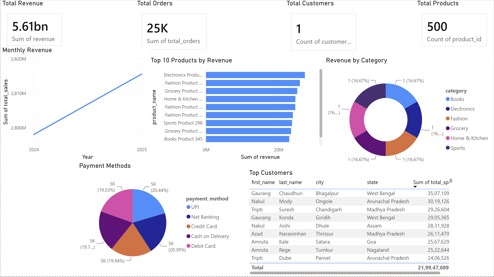
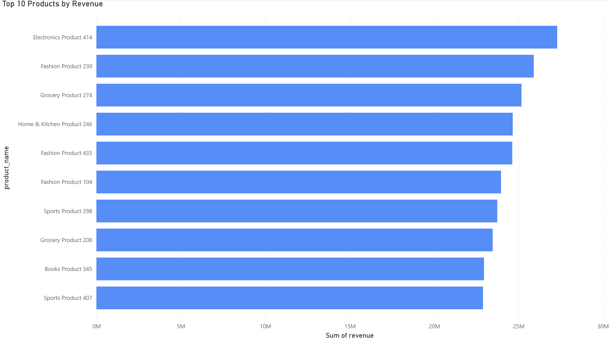
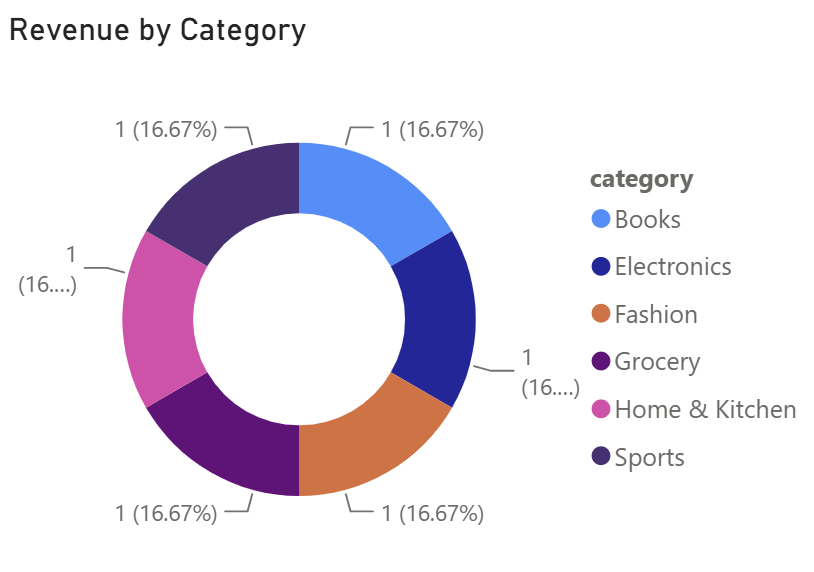
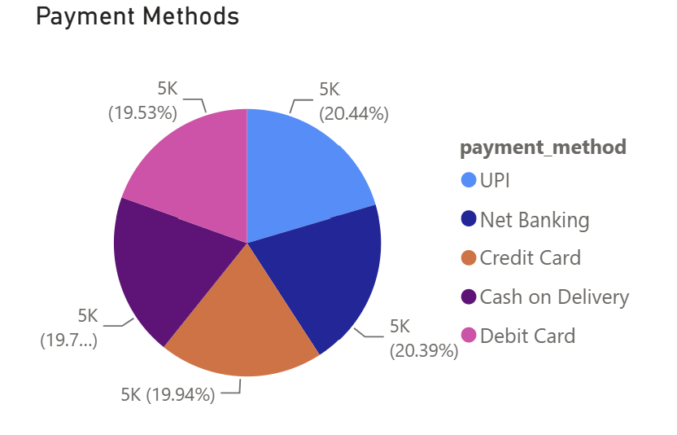
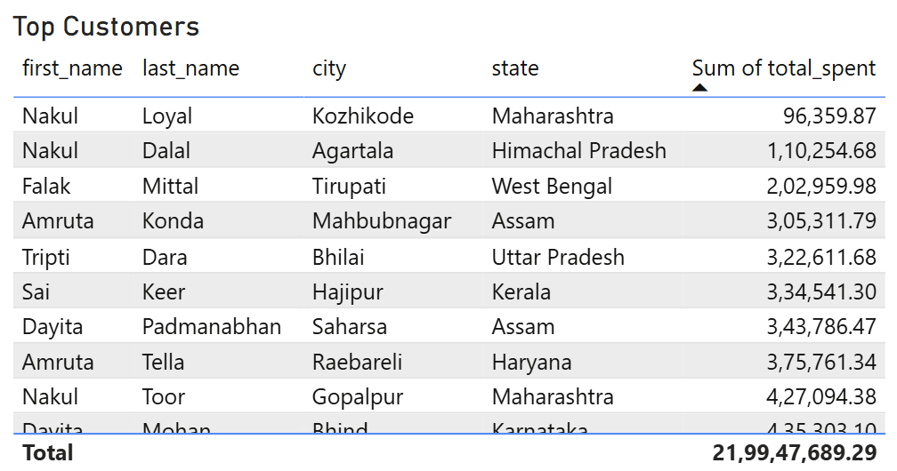

# 🛒 RetailX Enterprise ETL Pipeline

An end-to-end Data Engineering project that simulates a real-world retail company's ETL pipeline.

The project generates retail data, processes it through a modular ETL pipeline, stores it in PostgreSQL, creates SQL analytics views, and visualizes business insights using Power BI.

## 🚀 Technology Stack

- Python
- PostgreSQL
- SQLAlchemy
- Pandas
- Faker
- PostgreSQL Views
- Power BI
- Git & GitHub
- VS Code

## 📁 Project Structure

```text
Enterprise-ETL-Pipeline/
│
├── architecture/
├── dashboard/
├── data/
├── database/
├── docs/
├── logs/
├── screenshots/
├── src/
├── README.md
├── requirements.txt
└── .gitignore
```

## 🔄 ETL Workflow

```text
Generate Data
      │
      ▼
CSV Files
      │
      ▼
Extract
      │
      ▼
Transform
      │
      ▼
Validate
      │
      ▼
Load
      │
      ▼
PostgreSQL
      │
      ▼
SQL Analytics Views
      │
      ▼
Power BI Dashboard
```

## ✨ Features

- Generate realistic retail data using Faker
- Modular ETL pipeline
- Data validation
- Logging and error handling
- PostgreSQL integration
- SQL Analytics Views
- Interactive Power BI Dashboard
- Automated table refresh

## 📊 Dashboard Preview

### Executive Dashboard



### Monthly Revenue


### Top Products



### Category Sales



### Payment Distribution



### Top Customers



## ⚙️ Installation

### Clone the repository

```bash
git clone <your-github-repository-url>
```

### Navigate to the project

```bash
cd Enterprise-ETL-Pipeline
```

### Create a virtual environment

```bash
python -m venv venv
```

### Activate the environment

**Windows**

```bash
venv\Scripts\activate
```

### Install dependencies

```bash
pip install -r requirements.txt
```

### Configure the database

Update the `.env` file with your PostgreSQL credentials.

### Run the ETL Pipeline

```bash
python src/main.py
```

## 🚀 Future Improvements

- Apache Airflow Scheduling
- Docker Containerization
- Incremental Loading (UPSERT)
- Cloud Deployment (AWS/Azure)
- Data Quality Monitoring
- Automated Testing

